# StudentYU — Designing Connection in a Post-Pandemic Campus

An interactive UX case study exploring how students can discover communities, attend events, and build meaningful social connections in a low-pressure environment.

Live Prototype:  
https://www.figma.com/proto/Npy1aaziIFl838FLVuh0Lb/Interactive-Prototype

---

## Overview

StudentYU is a mobile-first social platform concept designed to address a growing issue in post-pandemic university life:

Students returning to campus often struggle to form new connections, leading to isolation and reduced engagement.

The platform focuses on making social discovery feel natural, accessible, and low-pressure.

---

## Problem

After COVID, many students experienced:

- difficulty approaching new people
- lack of structured opportunities to connect
- overwhelming or impersonal social platforms

This created a gap in how students discover communities and build relationships.

---

## Solution

StudentYU introduces a unified experience where users can:

- explore clubs, events, and student profiles
- receive personalized recommendations based on interests
- identify shared connections before engaging
- take small, confident steps toward social interaction

---

## User Story

A narrative-driven storyboard illustrating the journey from isolation to connection.

  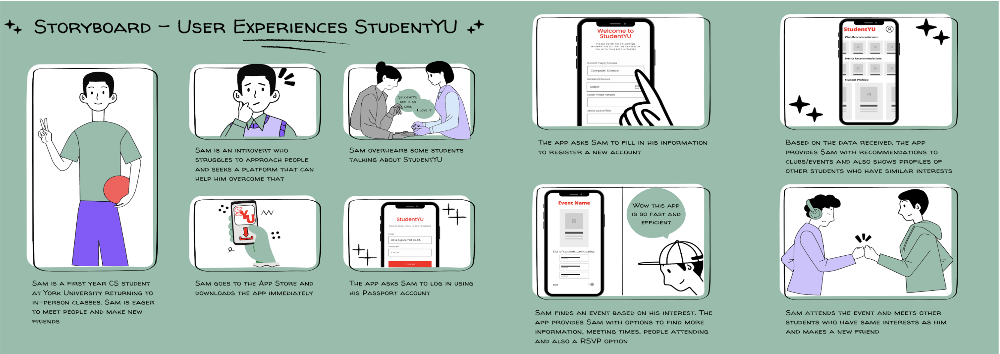

---

## Early Exploration

Low-fidelity wireframes used to define structure, navigation, and core user flows before visual design.

  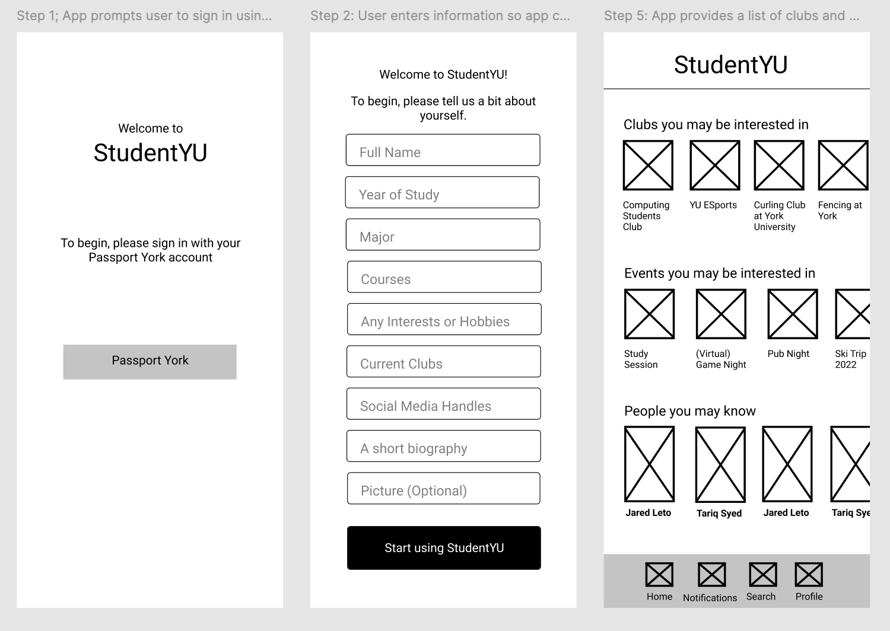

---

## Core User Flows

### Login Flow

  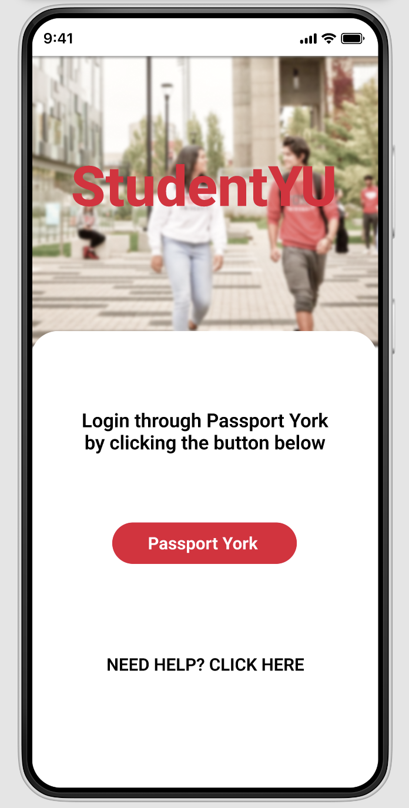
  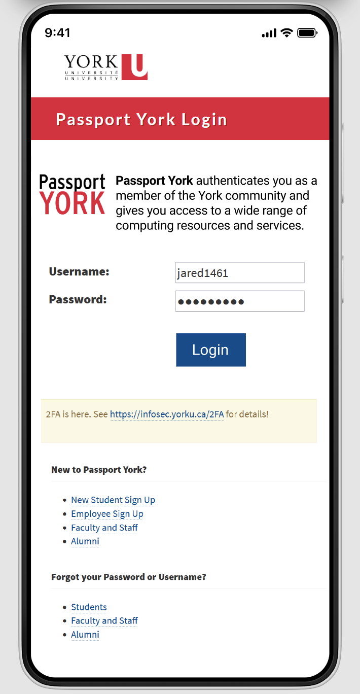

---

### Registration Flow

  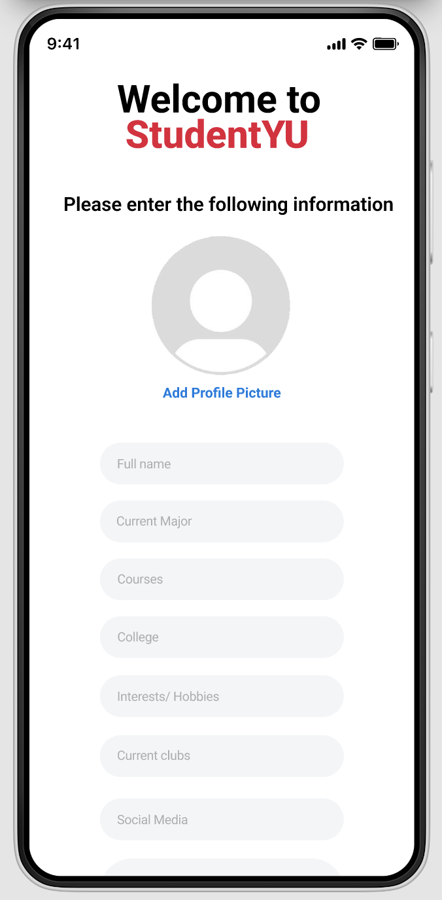
  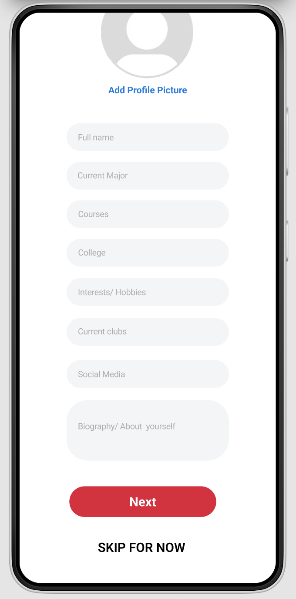

---

### Home Feed

  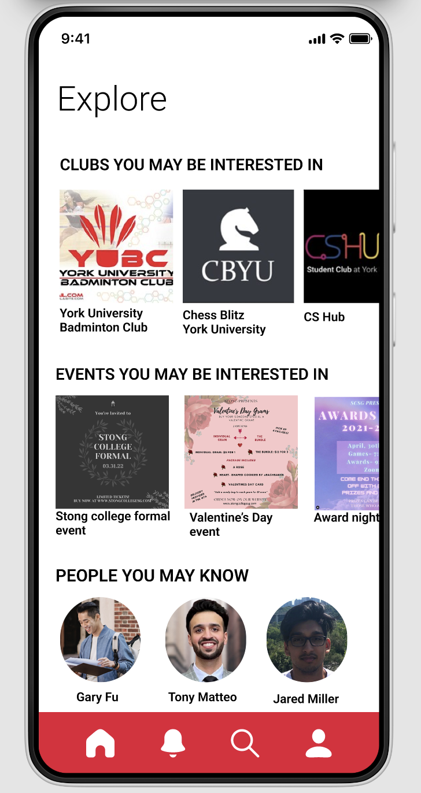

---

### Club Interaction

  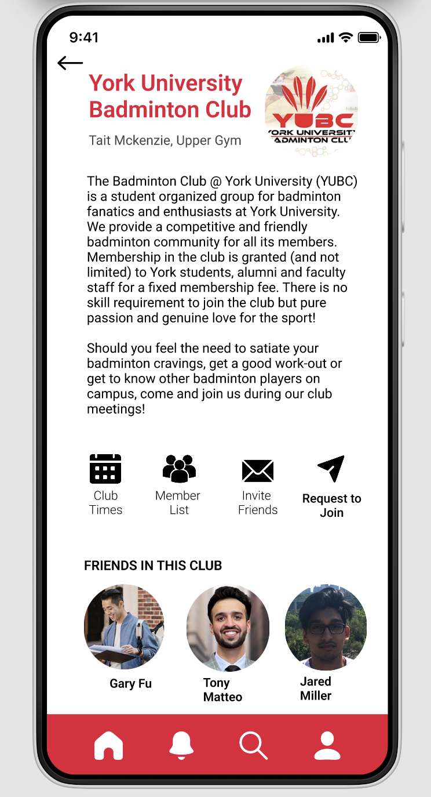
  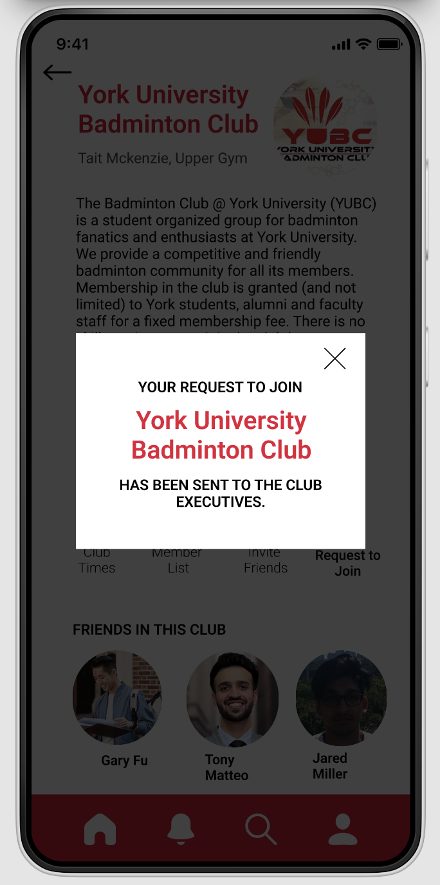

---

### Event Interaction

  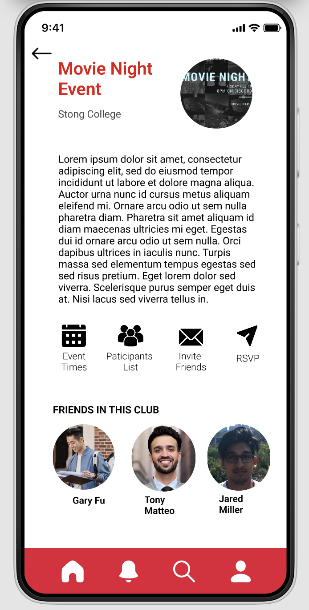
  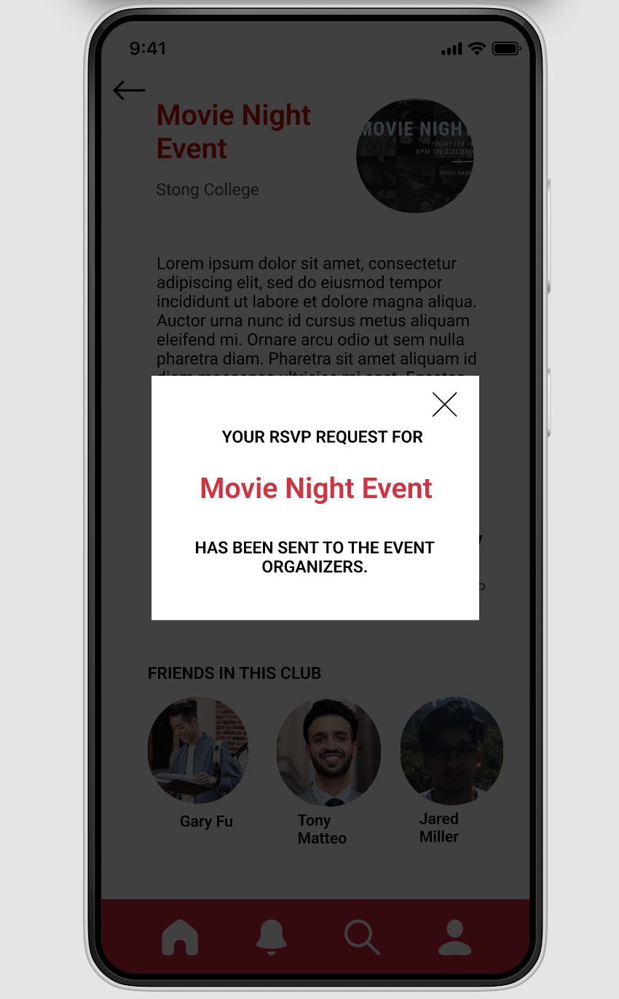

---

### Search Flow

  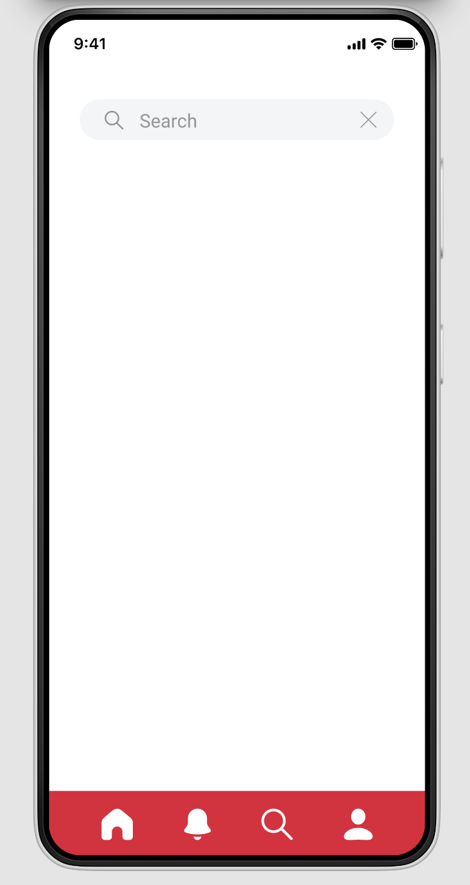
  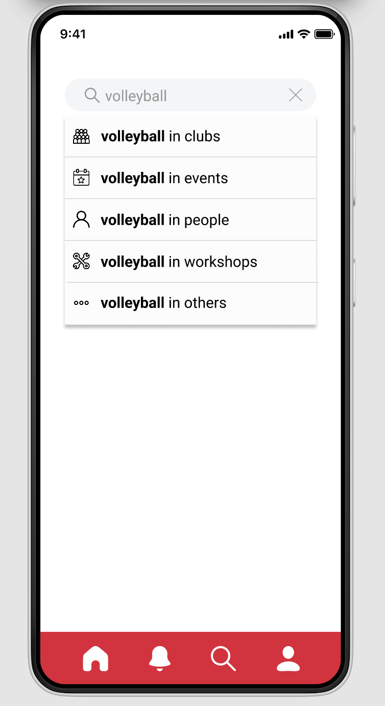
  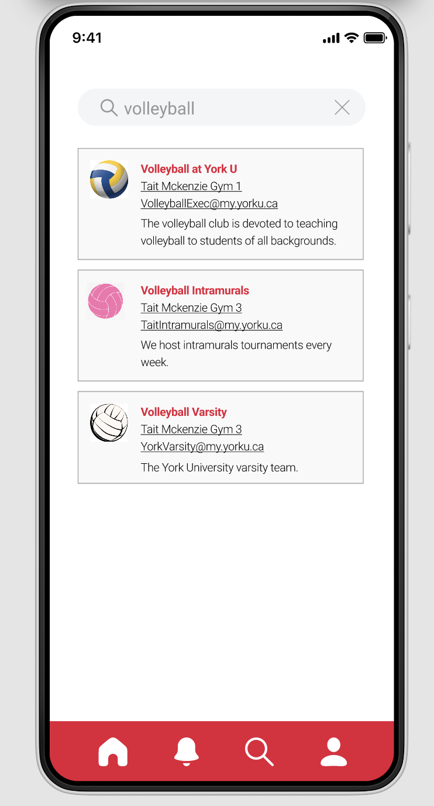

---

### Profile Interaction

  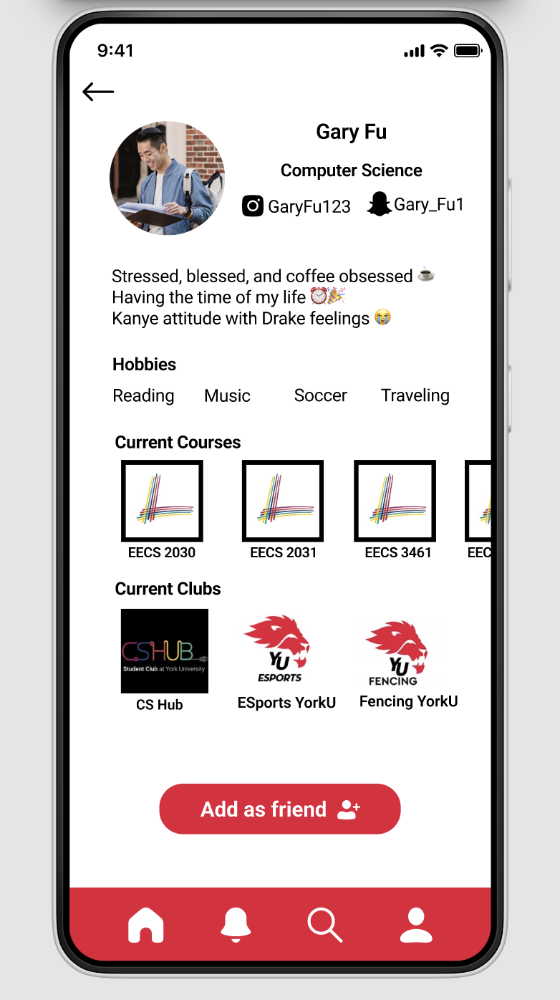

---

### Profile Settings

  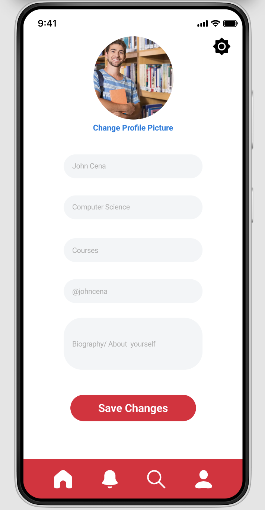
  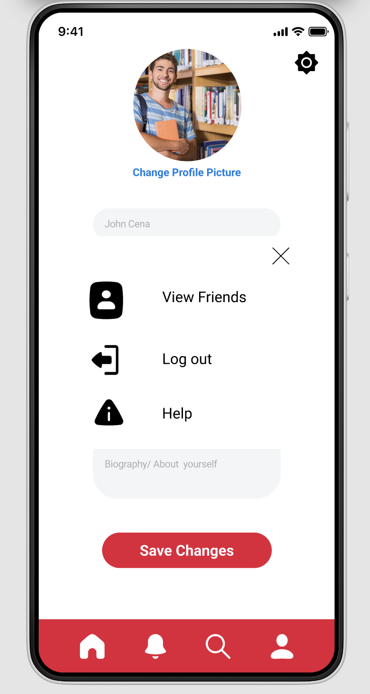

---

## Design Thinking

- Interest-based matching reduces friction when initiating conversations
- Social proof through shared connections increases confidence and participation
- A unified discovery system simplifies exploration across people, events, and communities
- Familiar authentication improves trust and usability

---

## My Role

Although this was a collaborative academic project, I led the design direction and core UX development.

My contributions included:

- leading the overall product concept and experience direction
- creating the storyboard and defining the user journey
- designing low-fidelity wireframes and key user flows
- developing the interactive prototype in Figma
- shaping UX decisions around discovery, onboarding, and engagement

---

## Key Learnings

- Designing for social interaction requires reducing psychological barriers, not just building features
- Small UX decisions, such as surfacing mutual connections, significantly influence user behavior
- Structuring discovery flows is critical for engagement and retention
- Clear user journeys are as important as visual design

---

## Note

This project was developed as part of a university UI/UX course and refined into a case study to highlight product thinking, user experience design, and system-level decision making.
